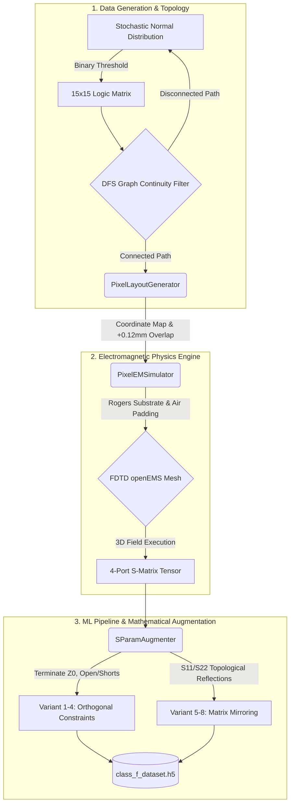

# Pixel: Automated FDTD Metamaterial & RF Trace Pipeline

**Pixel** is a programmatic, fully-automated pipeline designed to generate, simulate, and augment electromagnetic pixel-trace topologies using Finite-Difference Time-Domain (FDTD) simulations via **openEMS**.

The framework operates probabilistically to generate $15 \times 15$ binary grid structures bounded by strict topological continuity constraints, deploying full 3D physics solvers, and synthesizing machine-learning-ready augmented 2-port scattering parameter datasets natively into `HDF5`.

---

## 1. Quick Start & Execution

### 1.1. Environment Setup
Dependencies are managed via standard Python virtual environments. Key physics solvers include `openEMS` and its python wrapper `CSXCAD`, alongside data processing packages.

```bash
# Install required Python packages
pip install -r requirements.txt
```

### 1.2. Automated Dataset Orchestration
The primary entry point orchestrates random generation, openEMS execution, mathematical transformation, and HDF5 storage.
```bash
# Execute the main pipeline for a specified target of valid samples
python scripts/generate_dataset_orchestrator.py --samples 50
```

### 1.3. Topology Diagnostics
To verify signal propagation mechanics on sample meshes (assessing $|S_{11}|$ and $|S_{21}|$ Peak Transmission) without storing them:
```bash
python scripts/run_20_cases.py
```

---

## 2. System Workflow Pipeline

The end-to-end framework maps structural layout generation to multi-frequency tensor datasets through a highly rigorous, three-stage computational validation process.



---

## 3. Dataset Output Specification

The orchestrator outputs directly to `data/processed/class_f_dataset.h5`. The structure contains dynamically sized parallel arrays, highly optimized for deep learning loaders (e.g., PyTorch/TensorFlow).

| Dataset Node | Shape | DType | Description |
| :--- | :--- | :--- | :--- |
| `matrices` | `(N, 15, 15)` | `int8` | The core binary topology grids ($1$ = Copper, $0$ = Substrate). |
| `s_parameters` | `(N, 8, F, 2, 2)` | `complex64` | The complete augmented complex Scattering matrices for `F` frequency points across 8 topological equivalents. |
| `dfs_status` | `(N,)` | `bool` | Deterministic routing status (True = path exists between ports, False = isolated/open-circuit). |

*(Note: Data is automatically flushed to disk geometrically every 10 complete iterations to guarantee fault tolerance against CPU/Mesh interruptions.)*

---

## 4. Deep Architectural Documentation

Comprehensive mathematical constraints, physics logic, and programmatic execution patterns govern this framework. They are meticulously documented in the `docs/architecture` index:

* [**1. System Architecture & Generation**](docs/architecture/system_overview.md): Details the generative statistics ($\mu=0.5, \sigma=0.15$), matrix-to-physical coordinate transformations, and Depth-First Search (DFS) port bridging logic.
* [**2. Physics Engine Limits & Meshing**](docs/architecture/physics_engine.md): Elaborates on critical FDTD padding formulas ($40\times40 \text{mm}$ substrate spacing, $15\text{mm}$ Z-axis limits) and mesh resolution parameters to prevent PML boundary collapse.
* [**3. Machine Learning Data Pipeline**](docs/architecture/data_pipeline.md): Theory of S-parameter mathematical sub-reduction, Open/Short impedance dual-terminations utilizing `scikit-rf`, and dynamic mirroring logic.

---
**License**: Open Source  
**Core Dependencies**: `openEMS`, `CSXCAD`, `skrf`, `h5py`, `numpy`.
