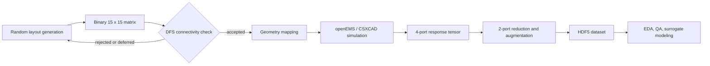
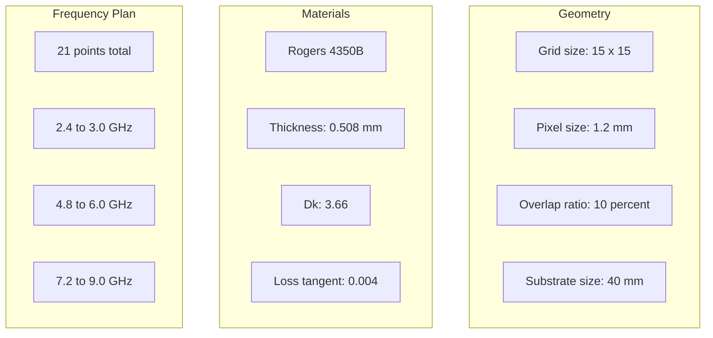
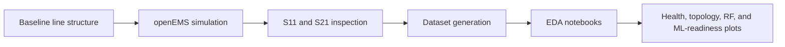

# Pixel

Pixel is a research-oriented electromagnetic data generation pipeline for pixelated RF layouts intended for surrogate modeling workflows around Class-F power amplifier structures. The repository combines stochastic layout synthesis, openEMS-based FDTD simulation, post-processing for reduced-port network views, and archival storage for downstream machine learning analysis.

The project is organized around a simple principle: generated data should remain physically motivated, reproducible, and inspectable. The implementation reflects that goal through explicit geometry rules, bounded material parameters, deterministic connectivity checks, and documented verification artifacts.

## Executive Summary

- **Problem domain:** rapid generation of simulation-backed RF layout data for data-driven design studies.
- **Primary artifact:** binary `15 x 15` conductive pixel layouts mapped to openEMS simulations and archived as HDF5 datasets.
- **Research relevance:** supports experimentation on how topology, connectivity, and termination conditions shape scattering responses used in surrogate-model development.
- **Validation posture:** includes a baseline transmission-line check, exploratory data analysis notebooks, and exported verification figures under [`tests/`](tests/).

## Research Relevance

This repository is aligned with the workflow described in the project context for AI-assisted Class-F power amplifier dataset generation. In practical terms, its relevance comes from four capabilities:

1. It parameterizes RF layout topology as a learnable image-like object without discarding physical geometry.
2. It preserves a physics solver in the loop, avoiding purely synthetic labels disconnected from electromagnetics.
3. It exposes topology and S-parameter distributions in forms suitable for audit before model training.
4. It stores results in a machine-learning-friendly structure that can be used for CNN, GNN, or surrogate regression experiments.

The project context and constraints are captured in [`AGENT_CONTEXT.md`](AGENT_CONTEXT.md). A fuller research framing is documented in [`docs/research_relevance.md`](docs/research_relevance.md).

## System Scope

The current repository implements the following end-to-end stages:

- binary layout generation with Gaussian-thresholded occupancy
- DFS-based left-to-right connectivity screening
- geometry expansion into overlapping conductive pixels
- openEMS simulation over configured frequency bands
- port-reduction and augmentation using ideal open and short terminations
- HDF5 dataset assembly for downstream analysis

Repository entry points:

- [`scripts/generate_dataset_orchestrator.py`](scripts/generate_dataset_orchestrator.py): sequential dataset generation and storage
- [`scripts/generate_bulk_dataset.py`](scripts/generate_bulk_dataset.py): checkpointed bulk generation with worker processes
- [`scripts/run_20_cases.py`](scripts/run_20_cases.py): small validation run across generated cases
- [`tests/verify_baseline.py`](tests/verify_baseline.py): baseline straight-trace verification

## Architecture





Technical details are broken out in the docs set:

- [`docs/architecture/system_overview.md`](docs/architecture/system_overview.md): layout conventions, port placement, and generator logic.
- [`docs/architecture/physics_engine.md`](docs/architecture/physics_engine.md): substrate, meshing, air volume, and boundary-condition design choices.
- [`docs/architecture/data_pipeline.md`](docs/architecture/data_pipeline.md): reduction from simulated responses to augmented learning-ready tensors.

## Data Products

The default sequential orchestrator writes to `data/processed/class_f_dataset.h5`. The stored arrays are intended to be consumed directly from Python-based ML workflows.

| Dataset | Shape | Meaning |
| --- | --- | --- |
| `matrices` | `(N, 15, 15)` | binary conductive layouts |
| `s_parameters` | `(N, 8, F, 2, 2)` | eight augmented 2-port variants per sample |
| `dfs_status` | `(N,)` | connectivity label from graph screening |

The bulk pipeline additionally stores `s_parameters_raw_4x4` in its aggregated output. A more complete storage description is in [`docs/dataset_specification.md`](docs/dataset_specification.md).

## Verification And Evaluation

The repository already contains exported evaluation figures in [`tests/`](tests/). These should be treated as evidence artifacts accompanying the analysis notebooks, not decorative images.

### Verification Flow



### Representative Results

**Dataset health and integrity audit**


This figure is an integrity checkpoint for NaN, Inf, and structural consistency review before model-facing use.

**Topology distribution analysis**


This view summarizes occupancy, connected-component behavior, and geometric diversity across generated samples.

**Population-level S-parameter behavior**


This plot family shows how the simulated response population behaves across the retained frequency grid, which is central for assessing whether the dataset is informative enough for surrogate modeling.

**Machine-learning readiness summary**


This artifact helps bridge RF verification and data-science readiness by checking whether the dataset appears stable, diverse, and structured enough for training workflows.

The complete verification set, with contextual explanations for each figure, is documented in [`docs/verification_and_evaluation.md`](docs/verification_and_evaluation.md).

## Getting Started

### Environment

Python dependencies:

```bash
pip install -r requirements.txt
```

Solver prerequisites are described in [`docs/environment.md`](docs/environment.md).

### Baseline Verification

```bash
python tests/verify_baseline.py
```

This generates a straight-through structure and plots baseline S-parameter behavior for quick solver sanity checking.

### Generate A Small Dataset

```bash
python scripts/generate_dataset_orchestrator.py --samples 10
```

### Run Bulk Generation

```bash
python scripts/generate_bulk_dataset.py --samples 20 --workers 4
```

### Run A Small Validation Sweep

```bash
python scripts/run_20_cases.py
```

## Documentation Guide

The documentation set is designed to be read in layers:

- [`docs/README.md`](docs/README.md): documentation hub and reading order
- [`docs/research_relevance.md`](docs/research_relevance.md): why the system matters for RF and surrogate-model studies
- [`docs/architecture/system_overview.md`](docs/architecture/system_overview.md): end-to-end system structure
- [`docs/architecture/physics_engine.md`](docs/architecture/physics_engine.md): simulation-domain design
- [`docs/architecture/data_pipeline.md`](docs/architecture/data_pipeline.md): transformation into ML-ready datasets
- [`docs/dataset_specification.md`](docs/dataset_specification.md): stored tensors, semantics, and provenance
- [`docs/verification_and_evaluation.md`](docs/verification_and_evaluation.md): baseline checks, notebooks, and figure interpretation
- [`docs/operations.md`](docs/operations.md): execution paths, outputs, and operational notes
- [`docs/environment.md`](docs/environment.md): solver and Python environment setup

## Notes On Repository Status

This README intentionally distinguishes between project intent and repository evidence. The project context describes a strict research contract; the implementation documents what is currently present in code and what outputs are already available in the repository. That separation is important for technical credibility and future extension work.
