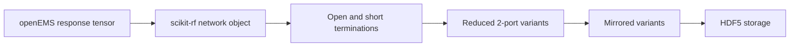

# Data Pipeline

## Overview

The data pipeline transforms solver output into learning-ready tensors while keeping the intermediate semantics understandable. Its three main steps are simulation output capture, port reduction, and archival storage.

## Flow

## Raw Solver Output

The simulator returns a complex array with the shape:

`(frequency, port, port)`

This tensor is then passed to the augmentation logic in [`src/utils/data_augmenter.py`](../../src/utils/data_augmenter.py).

## Port Reduction

The augmentation module uses `scikit-rf` to terminate selected ports with idealized loads:

- open circuit: reflection coefficient `+1`
- short circuit: reflection coefficient `-1`

The remaining ports define a reduced two-port network suitable for downstream learning tasks.

## Eight-Variant Augmentation

For each raw response tensor, the pipeline creates eight `2 x 2` variants:

- four direct variants produced by different open and short assignments
- four mirrored variants derived from port-order inversion of the direct variants

This increases dataset cardinality without re-running the expensive EM simulation for every reduced-port view.

## Storage

The sequential orchestrator writes arrays into a resizable HDF5 file and flushes periodically. The bulk generator writes compressed checkpoint files first and later aggregates them into a final HDF5 artifact.

## Why This Matters For ML

This reduction and storage design does three useful things:

- it preserves complex-valued network information
- it creates consistent tensor shapes for model pipelines
- it separates expensive field solving from cheaper algebraic augmentation

## Caution On Interpretation

Augmentation improves sample count and view diversity, but it does not replace independent electromagnetic simulations under new geometries or materially different excitation conditions. It should be interpreted as a structured transformation of existing responses, not as wholly new physical experiments.
