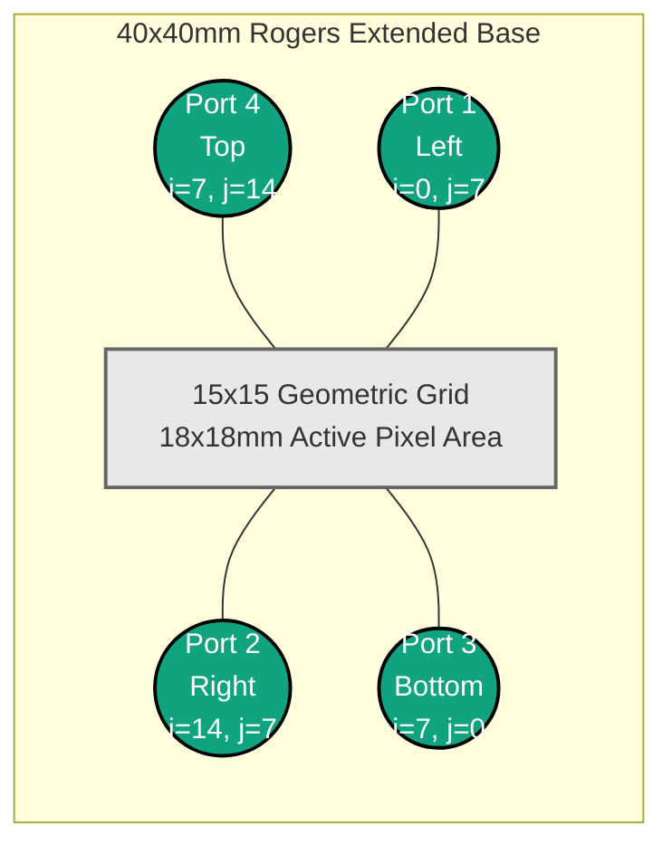

# System Architecture & Generation Logic

The generative system in **Pixel** handles the mathematical creation and graph-based validation of topologies representing printed circuit board (PCB) micro-traces.

## 1. Port Identification & Circuit Layout

The framework strictly bounds microstrip layout paths within a $15 \times 15$ discretized coordinate map. Specifically, exactly 4 ports anchor the periphery of this map. Port connections provide the standard interface between FDTD energy injections and geometric routing lines.

### Reference: 50-Ohm Baseline Transmission Line
A baseline calibration structure represents an uninterrupted, straight strip of metal connecting **Port 1 (Left)** directly to **Port 2 (Right)**.
* **Layout Matrix Representation**: `matrix[:, 7] = 1`, meaning column `0-14` is entirely metallic at row index `7`.
* **Behavior Characteristics**: Evaluated against standard characteristic impedance ($50\Omega$), demonstrating minimum Reflection $|S_{11}|$ and highly efficient Forward Transmission $|S_{21}|$ approaching $0 \text{ dB}$.
* *Note: Run `verify_baseline.py` in the root directory to generate and capture this baseline structure visually as `baseline_layout.png` and `baseline_S_params.png`.*

## 2. Stochastic Generation Model

The layouts are bounded inside a $15 \times 15$ continuous grid. To mimic clustered contiguous metal traces (rather than completely random salt-and-pepper noise), the `PixelLayoutGenerator` implements a continuous stochastic process.

1. **Normal Distribution Base**: An underlying array of continuous values is generated using a Gaussian normal distribution: 
   $$ \mathcal{N}(\mu=0.5, \sigma=0.15) $$
2. **Bounds Clipping**: Matrix numbers are clamped strictly to $[0.0, 1.0]$.
3. **Thresholding**: Values $\geq 0.5$ are categorized as $1$ (conductive metal), while values $< 0.5$ are categorized as $0$ (substrate dielectric). 

## 3. Graph Continuity & Depth-First Search (DFS)

Since electromagnetic signals require physical propagation, topologies must be evaluated for continuity. A system generating purely random noise will mostly generate isolated metallic islands consisting of open circuits. 

The framework systematically guarantees a strict dataset ratio: **80% Connected** vs **20% Disconnected** geometries. 

To evaluate this accurately without using computationally heavy simulations, a Depth-First Search (DFS) graph algorithm parses the binary grid array.
* The system designates exactly 4 excitation interface indices correlating to the physical microstrip ports at the edges:
  * Left: `(0, 7)`
  * Right: `(14, 7)`
  * Top: `(7, 14)`
  * Bottom: `(7, 0)` 

**Validation Rule**: If the DFS tree branching through adjoining horizontal/vertical grid elements successfully visits from **Port 1 (Left)** directly to **Port 2 (Right)**, the structure is deemed `Connected`. Otherwise, it is labeled an open circuit for the purposes of $S_{21}$ wave propagation.

## 4. Coordinate Space Mapping

Indices `(i, j)` natively exist from $[0, 14]$. To execute a physical geometry engine symmetric around an origin `(0,0)`, the grid undergoes an absolute geometric translation logic relying on the component feature dimension ($1.2\text{mm}$).

$$ C_x = (i - 7) \times 1.2\text{mm} $$
$$ C_y = (j - 7) \times 1.2\text{mm} $$

This mapping bridges the abstracted `numpy` array to the physical CSX geometry builder reliably.
