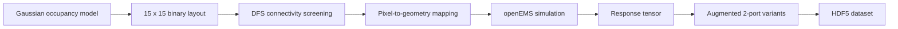

# System Overview

## Purpose

The system converts a compact binary geometry representation into simulation-backed RF response data. It is designed so that each stage remains conceptually separable: layout generation, connectivity screening, geometry construction, simulation, reduction, and storage.

## Pipeline Structure

## Layout Convention

The active design space is a `15 x 15` grid. Each element indicates whether conductive metal is present at that pixel location.

- grid size: `15`
- pixel size: `1.2 mm`
- overlap ratio: `10 percent`

Port convention:

- left port: `(0, 7)`
- right port: `(14, 7)`
- bottom port: `(7, 0)`
- top port: `(7, 14)`

These conventions are set in the generator and simulator logic and form the basis of the connectivity and augmentation procedures.

## Connectivity Screening

The generator in [`src/generators/matrix_generator.py`](/home/dr-robin-kalyan/Desktop/pixel/src/generators/matrix_generator.py) uses a normal distribution with thresholding to generate candidate layouts, then applies a depth-first search over four-neighbor adjacency. The implemented acceptance logic is centered on left-to-right reachability because that is the path used for the primary transmission screen.

## Geometry Mapping

Each conductive pixel is mapped into a conductive box on top of the substrate. Pixel overlap is intentionally introduced so that logically adjacent metal cells remain physically continuous after meshing.

Coordinate mapping:

- `cx = (i - 7) * pixel_size`
- `cy = (j - 7) * pixel_size`

This places the active layout around the origin while preserving index semantics.

## Baseline Reference Structure

The baseline verification script defines a center-row conductive path between the left and right ports. This acts as the simplest reference geometry for checking whether the geometry builder and solver produce qualitatively sensible transmission behavior.

## Design Intent

The overall architecture is meant to support a physics-aware data generation workflow rather than a purely random synthetic dataset. The separation between generation, simulation, and reduction is therefore an important part of the system design and should be preserved as the repository evolves.
