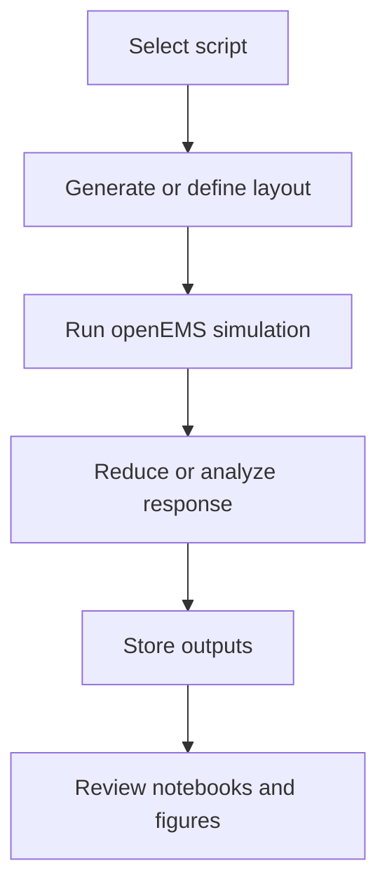

# Operations Guide

## Overview

The repository provides multiple execution paths depending on whether the goal is solver validation, a small controlled dataset run, or larger checkpointed generation.

## Script Guide

### Baseline solver sanity check

Command:

```bash
python tests/verify_baseline.py
```

Use when:

- validating a fresh openEMS and CSXCAD installation
- checking that the geometry pipeline can build and simulate a simple trace
- generating quick visual artifacts for the baseline structure

Primary outputs:

- `baseline_layout.png`
- `baseline_S_params.png`
- temporary solver files under `temp_baseline/`

### Sequential orchestration

Command:

```bash
python scripts/generate_dataset_orchestrator.py --samples 10
```

Use when:

- generating a modest dataset with straightforward control flow
- validating end-to-end storage into a single HDF5 file

Primary output:

- `data/processed/class_f_dataset.h5`

### Bulk checkpointed generation

Command:

```bash
python scripts/generate_bulk_dataset.py --samples 20 --workers 4
```

Use when:

- running larger simulation batches
- preserving intermediate results across long jobs
- aggregating worker outputs into a final dataset

Primary outputs:

- `data/processed/checkpoints/sample_*.npz`
- `data/processed/final_dataset.h5`

### Small validation sweep

Command:

```bash
python scripts/run_20_cases.py
```

Use when:

- surveying connected and disconnected examples
- reviewing qualitative transmission behavior
- producing a small report without full dataset assembly

## Execution Flow



## Operational Notes

- The solver dependencies are external to the Python package set and must be installed first.
- The code expects local write access for simulation directories and output data.
- Bulk generation uses worker-specific directories and compressed checkpoint files for fault tolerance.
- The current workflows are designed for local execution rather than distributed orchestration.

## Recommended Run Order For A Fresh Clone

1. Validate solver imports using [`environment.md`](/home/dr-robin-kalyan/Desktop/pixel/docs/environment.md).
2. Run [`tests/verify_baseline.py`](/home/dr-robin-kalyan/Desktop/pixel/tests/verify_baseline.py).
3. Run a small sequential dataset job.
4. Review the output with the notebooks in [`tests/`](/home/dr-robin-kalyan/Desktop/pixel/tests).
5. Move to bulk generation only after the baseline and small-run outputs look credible.
