# Verification And Evaluation

## Verification Philosophy

The repository follows a layered verification approach:

1. establish a simple baseline structure with known qualitative behavior
2. generate and inspect sample populations
3. audit exported datasets for structural and numerical consistency
4. use population-level plots to judge whether the data is suitable for model development

## Baseline Verification

The baseline script [`tests/verify_baseline.py`](../tests/verify_baseline.py) constructs a straight conductive trace connecting the left and right ports through the center row of the `15 x 15` grid. Its intent is to provide a simple sanity check for geometry construction and basic transmission behavior.

Expected qualitative outcome:

- low reflection relative to a disconnected or poorly matched structure
- stronger forward transmission than disconnected cases
- stable response curves over the configured frequency points

## Analysis Assets In `tests/`

The `tests` directory contains notebooks and exported figures that document dataset quality and interpretability:

- [`tests/Samples_EDA.ipynb`](../tests/Samples_EDA.ipynb): sample-oriented exploratory analysis
- [`tests/class_f_pa_eda_5000.ipynb`](../tests/class_f_pa_eda_5000.ipynb): larger population-level analysis

## Exported Figure Set

### 1. Dataset health audit

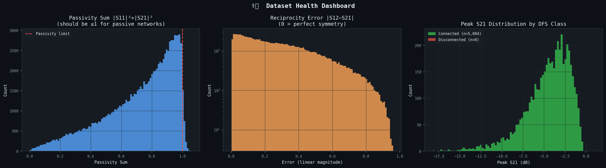

Purpose: numerical integrity screening for invalid values and structural anomalies.

### 2. Topology analysis

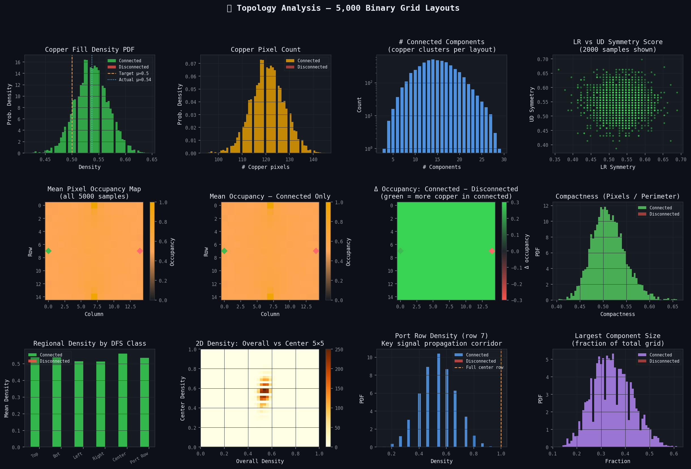

Purpose: evaluate occupancy, connectivity-related structure, and geometric spread across generated layouts.

### 3. S-parameter population analysis

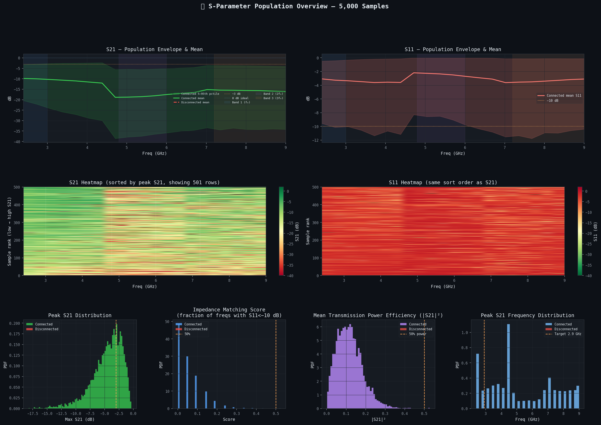

Purpose: inspect aggregate scattering-response behavior across the dataset.

### 4. Frequency-domain behavior

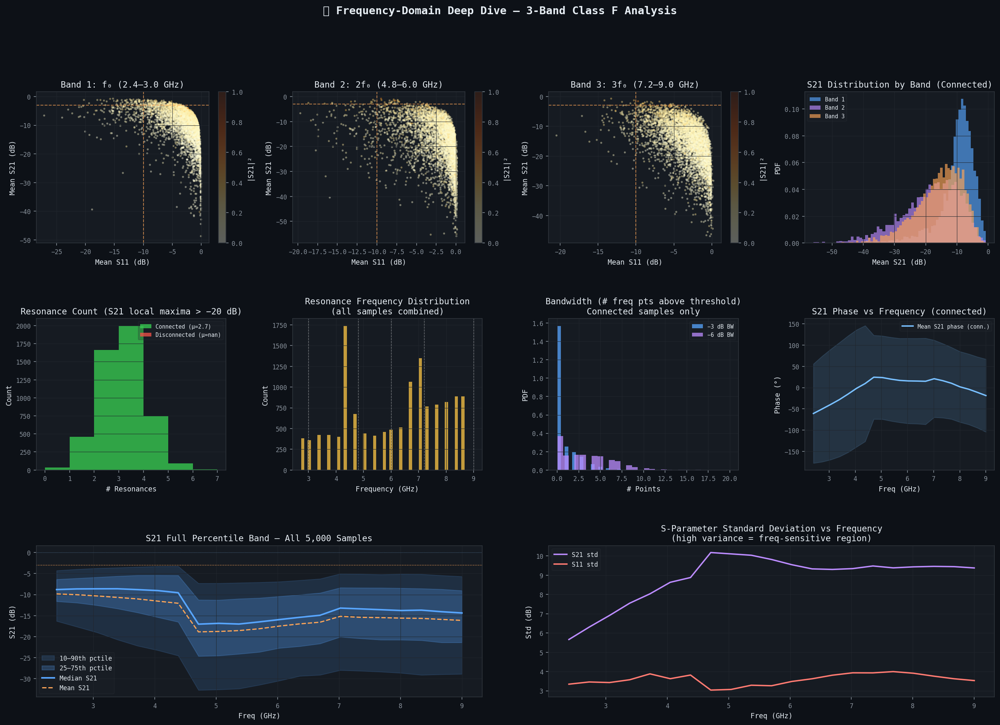

Purpose: view how response characteristics evolve over the retained frequency plan.

### 5. Augmentation audit

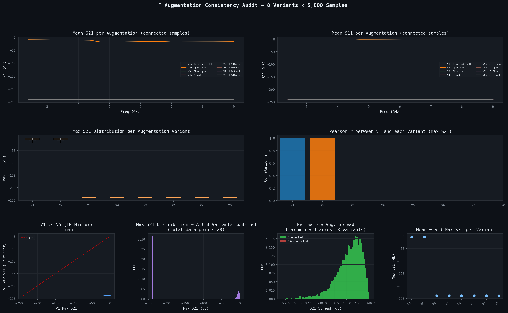

Purpose: assess whether the reduced-port augmentation process produces coherent and diverse variants.

### 6. Impedance and Smith-chart inspection

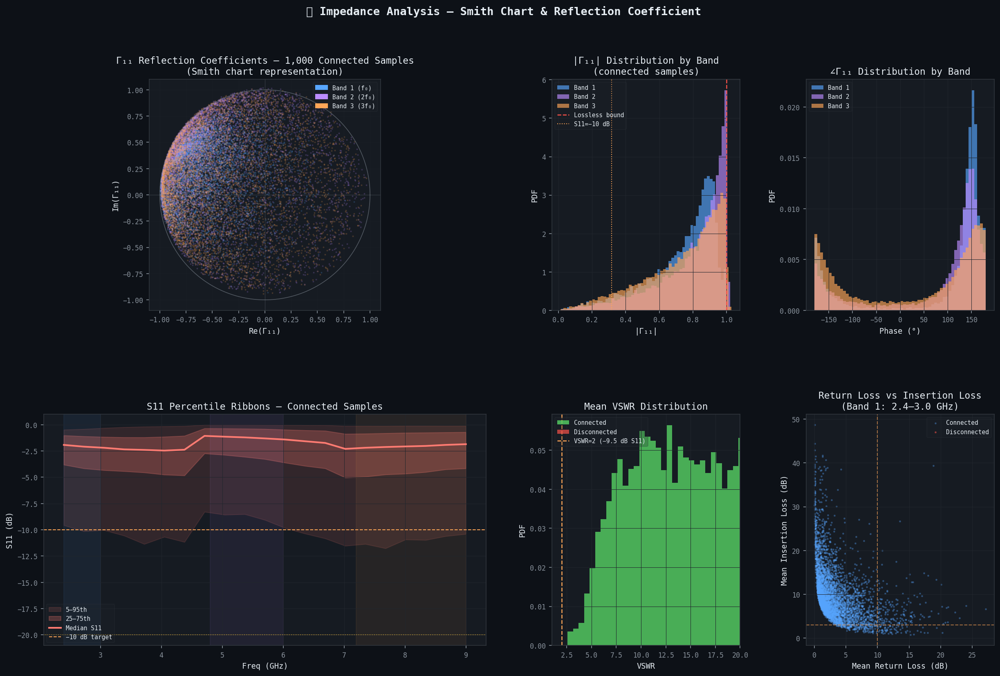

Purpose: relate scattering behavior to network interpretation in standard RF analysis terms.

### 7. Pixel-importance view

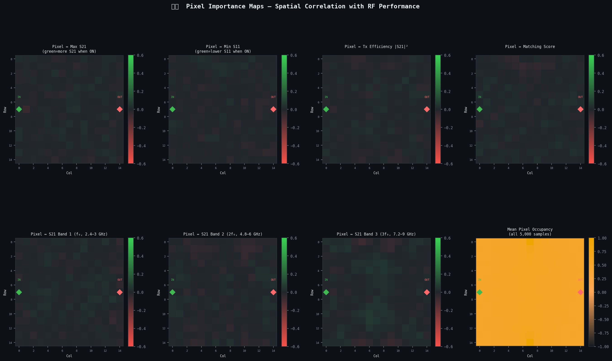

Purpose: identify geometry regions with stronger apparent influence on observed responses.

### 8. Outlier and PCA analysis

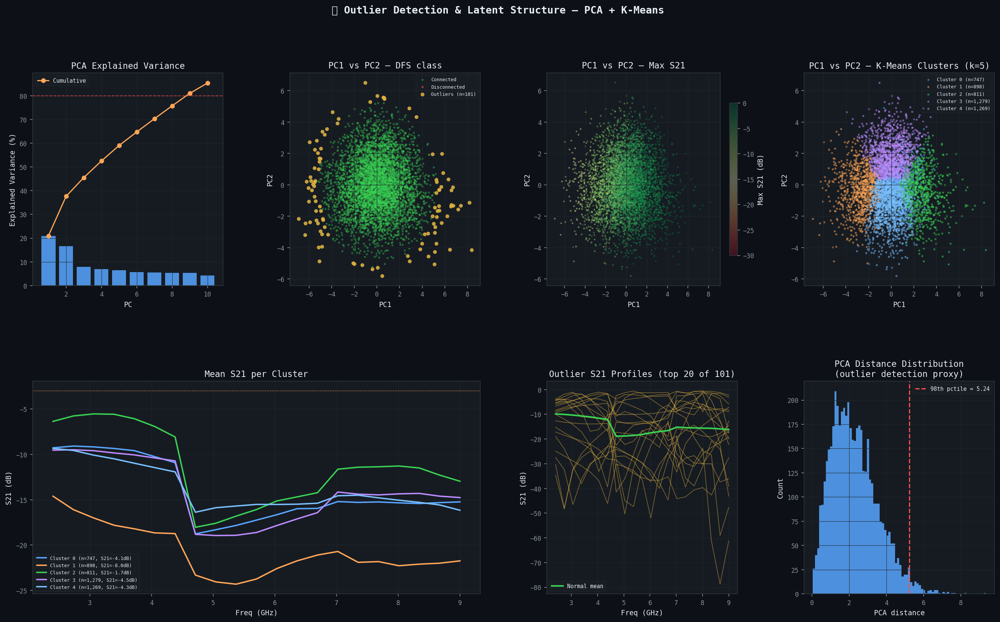

Purpose: reveal unusual samples and summarize latent population structure.

### 9. Class-F compliance-oriented summary

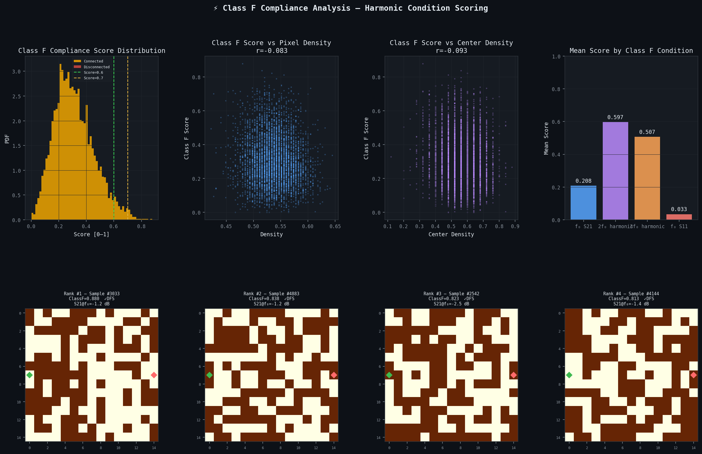

Purpose: connect dataset behavior back to the intended power-amplifier research framing.

### 10. Machine-learning readiness

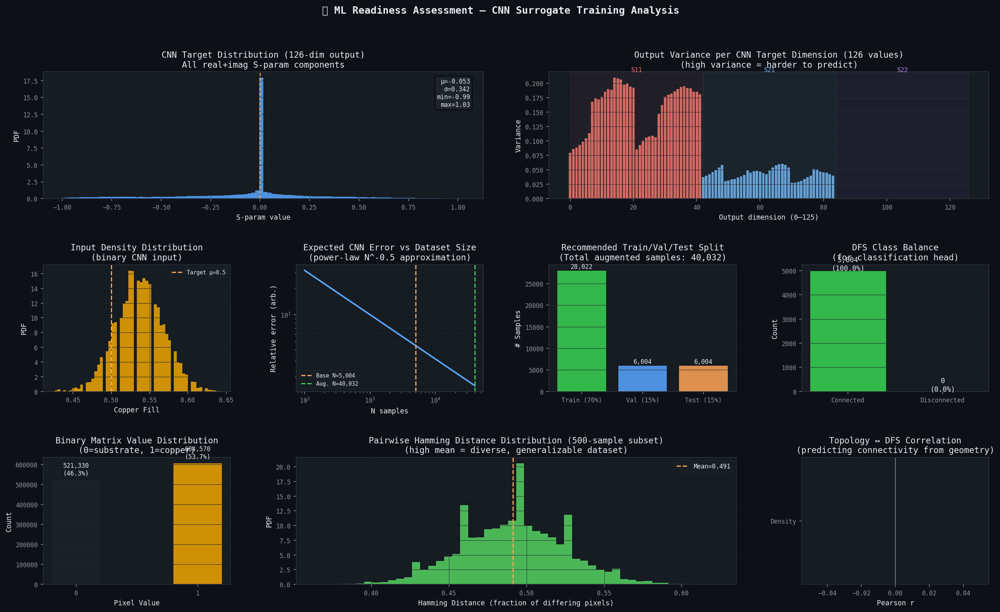

Purpose: assess whether the generated data appears sufficiently coherent for modeling workflows.

### 11. Interpretation summary

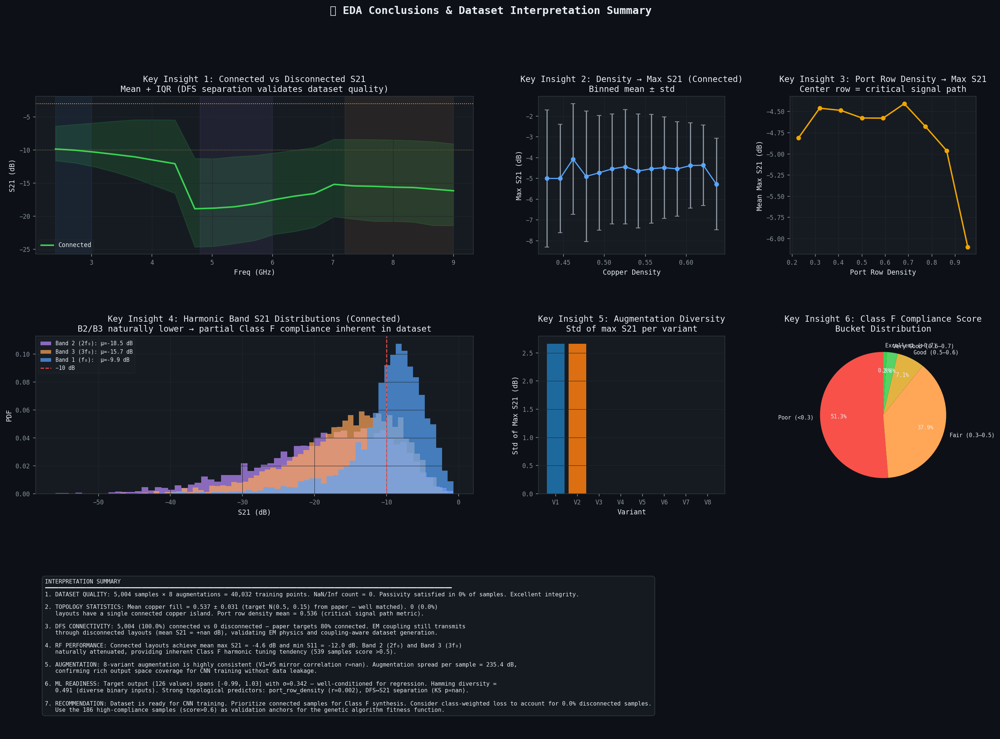

Purpose: provide a compact synthesis of findings from the broader analysis notebooks.

## How To Use These Artifacts

- Read them as evidence supporting dataset quality, not as a replacement for formal unit tests.
- Pair them with the baseline script when validating a fresh environment.
- Re-generate them after major changes to geometry logic, solver setup, or augmentation routines.

## Suggested Next Verification Steps

- automate numerical assertions for baseline response thresholds
- add schema checks for HDF5 outputs
- add regression tests for augmentation shape and port semantics
- persist generation manifests for stronger run-to-run auditability
